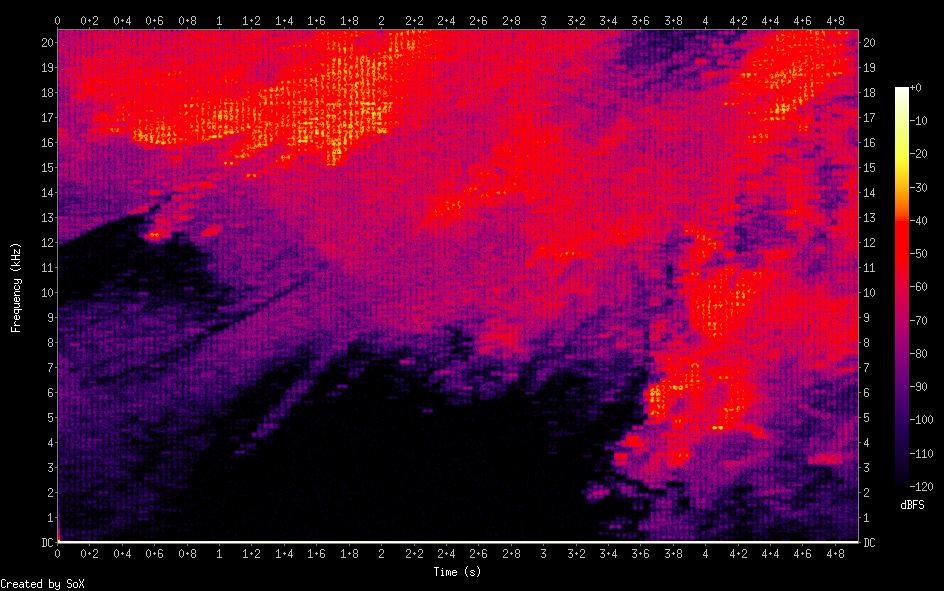
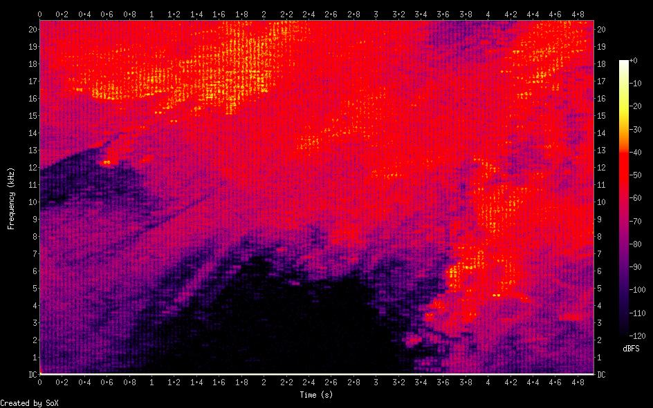
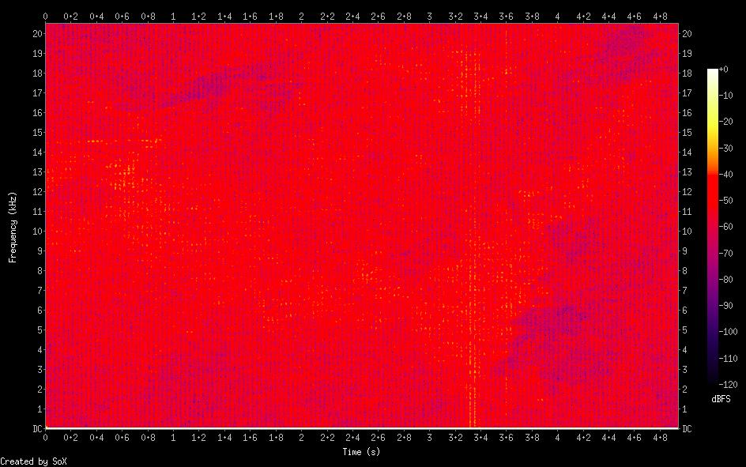

# Sound To Image

This code converts an image file to a sound by treating the image as a discrete time fourier transform and inverting it.

## Usage

install the requirements from `requirements.txt` and then run `image_to_sound.py`

```shell
./image_to_sound.py <image_file> | --fs <Hz>  | --out_duration <seconds> | --rescale <positive_float> | --out_file <name>.wav
```

The lower `fs` is the longer the output will be so use `--out_duration` if you need a low fs.
`--rescale` raises the image intensity to the given power.
Use a value > 1 to incrase contrast in dark images (most images I've tried look best with this).
Use a value < 1 to increase contrast in bright regions.

## To superimpose image's audio on other audio
```shell
$ ./image_to_sound.py image.jpg --fs 44100 --out_duration 298.06 # duration of song in seconds
$ sox -m -v 0.01 image_sound_file.wav -v 1 song.wav song_with_image.wav
```

### Example commands 

Let's play with the demo image.

```
$ # 1
$ ./image_to_sound.py demo/demo.jpg --out_duration 5
$ # 2
$ ./image_to_sound.py demo/demo.jpg --out_duration 5 --rescale 7.3
$ # 3
$ ./image_to_sound.py demo/demo.jpg --out_duration 5 --rescale 1 --out_file my_sound.wav
```

command 3 shows the importance of rescaling (default 10) with most color images.




